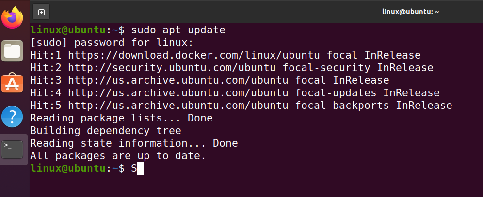
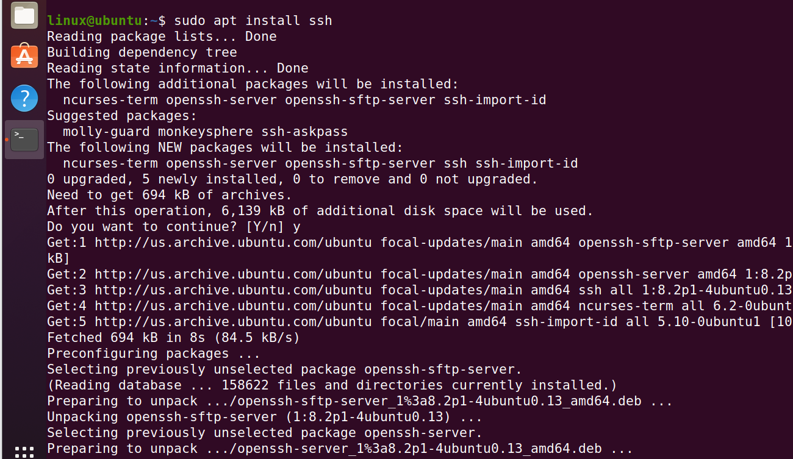
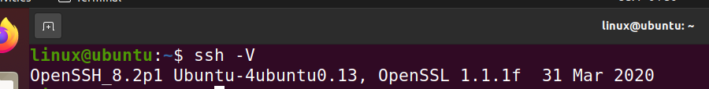
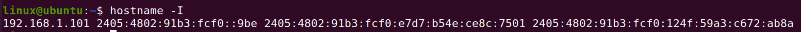
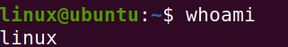
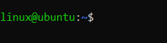
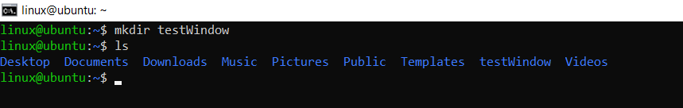
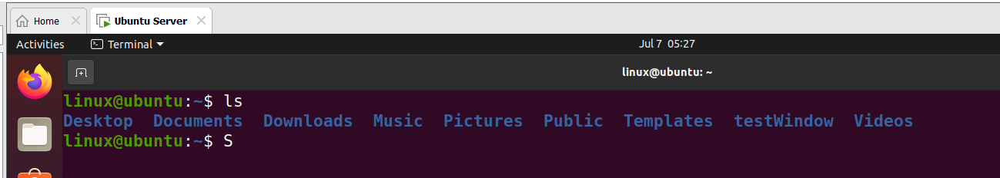

# Connect to a remote computer using SSH protocol

## What is ssh?

SSH (Secure Shell) is a cryptograpic network protocol used to securely operate network services over unsecured networks.

It allows users to:

* Remotely log in to another computer using the command line
* Execute commands on a remote machine
* Transfer files securely between computers

SSH uses TCP port 22 by default.

SSH replaced older unencrypted remote access protocols such as Telnet, which transmitted data (including passwords) in plain text.

## Install SSH on Ubuntu 20.04
Run
```Bash
sudo apt update
```
Example output:


Run
```Bash
sudo apt install ssh
```
Example output:

## Check SSH version
To verify SSH installation:
```Bash
ssh -V
```
Example output:

## Connect from Window to Linux Using SSH

1. **Get Linux IP Address and Username**

    Before connecting, you need:
    
    * Linux IP address
    * Linux username


**Check IP Address**

On Linux terminal:
```Bash
hostname -I
```
Example ouput


**Check Username**
```Bash
whoami
```
Example ouput


2. **Connect Linux Server**
SSH syntax:
```Bash
ssh username@server_ip
```
Example:
```Bash
ssh linux@192.168.1.101
```
Explanation:

* ssh --> start SSH client.
* linux --> Linux username. 
* 192.168.1.101 --> Linux server IP address.

After login successfully, your Windows CMD will become a Linux terminal session. 

Example:



**Test SSH Remote Command**
Create a folder from Windows CMD on the Linux machine.

Run:
```Bash
mikdir testWindow
```


**Verify Folder on Linux Server**
Go back to Linux and check:
```Bash
ls
```
You should see:

*testWindow*

Example:



## Copy folder from Windows to Linux

Using **scp**

Example:I want copy file **iot_kit-0.0.1-SNAPSHOT.jar**  to **/home/linux/Documents/iot**
```Bash
scp -r iot_kit-0.0.1-SNAPSHOT.jar linux@192.168.1.100:/home/linux/Documents/iot
```
Open CMD **Window**:

Verify on **Linux**:


